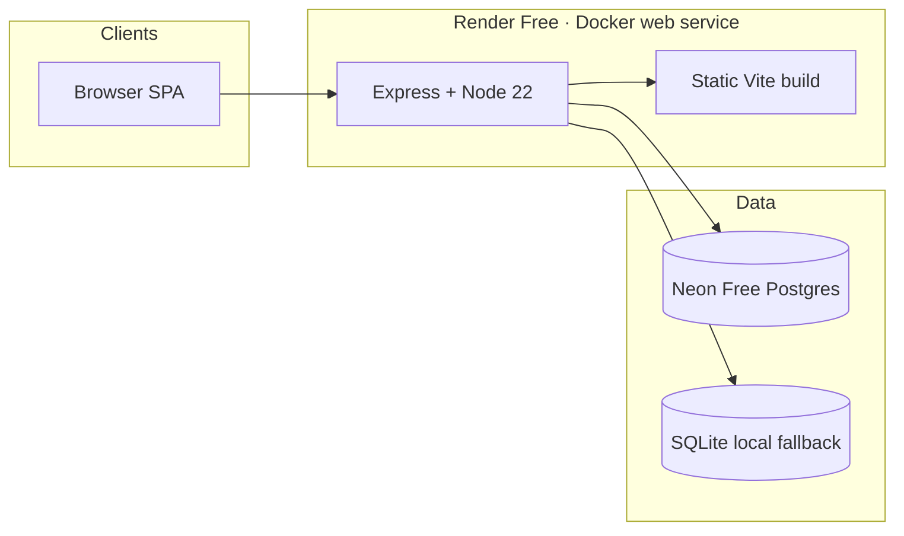

# Architecture

SAVENTRA Technologies is a candidate-first staffing app. People sign up, upload a resume, see scored jobs, tailor a few lines, apply, and track the pipeline.

## System overview



- Frontend: React 19, Vite, TypeScript, CSS (`apps/web`)
- Backend: Node 22, Express, JWT (`apps/api`)
- Database: Neon Postgres (prod), SQLite (local default)
- Hosting: Render Free Docker service (Oregon)

Same deploy shape as murali-transport: one container serves the API and the built SPA.

## Repository layout

```
staffing-copmany/
├── apps/web/          React SPA
├── apps/api/          Express API
├── Dockerfile         Multi-stage: build SPA, serve with Node
├── render.yaml
└── docs/
```

## Runtime

Production: Vite builds with `VITE_API_BASE=` (same origin). Express serves `/v1/*`, `/healthz`, and `index.html`.

Local: Vite on `5175` proxies `/v1` and `/healthz` to Express on `8000`.

## Matching

`matching.js` extracts skills from a lexicon, titles, and years, then scores each job:

- Skill overlap (largest weight)
- Title similarity
- Keyword hit
- Location / remote
- Seniority vs years

Tailoring (`tailor.js`) only rephrases existing bullets and a skills line. It does not invent employers or dates.

## Job sources

1. Seeded catalog (company-style postings plus SAVENTRA-owned roles)
2. Admin desk can publish more roles
3. Live public APIs after resume upload and on `GET /v1/matches`: Remotive, Arbeitnow, The Muse, Remote OK, Himalayas, Jobicy
4. Optional Adzuna API (`ADZUNA_APP_ID`, `ADZUNA_APP_KEY`)
5. LinkedIn / Indeed / Google Jobs search links from the resume title (not scraped listings)

We do not scrape LinkedIn, Indeed, or Greenhouse. Apply records status locally (`POST /v1/applications` and `POST /v1/applications/batch`) and opens `source_url` so the candidate can finish the employer form. We do not POST into a third-party ATS.
